# Overview

This guide is intended for the students in CS 340 who want to take a path through the class using Flask/Python instead of Node.js.

This guide walks through everything from getting the tools setup to work on the app, setting up the infrastructure required to build and run your app on OSU's flip server.

There are a few assumptions that are made when this guide is written:

- You have basic familiarity with Python and MySQL syntax
- You are capable of opening a terminal and navigating using basic commands like `cd`, `ls`, etc.
    - I will present the Windows command prompt equivalents however I strongly recommend getting a proper terminal installed. Life will be way easier; I promise!
- You are developing your project on your own machine and not directly on the OSU server
    - We will point out differences for those who are working on the OSU server or any steps you might need to take
- This guide was developed using Windows 10 coupled with Windows Subsystem for Linux 2 (running Ubuntu). I will point out any variations where commands or tasks are different for users with other setups.

## Contributions

This guide is based off of the work previously done by prior TA and student, @mlapresta. Her previous work can be found in the repo [mlapresta/cs340_starter_app](https://github.com/mlapresta/cs340_starter_app). Without this work, this would have been a larger endeavor. In particular, we use her `db_connector.py` and `db_credentials.py` as well as some of her documentation.

Dr. Curry and Prof. Safonte for allowing me the time to build the guide and project for other students to benefit from.

Step 0 and Step 7 sections added by TA Andrew Kamand.

## Clone and Go

You can clone this repo as is, and it will run, so long as you have loaded the data from `/database/bsg_db.sql` to a properly configured MySQL database which is running, have a propertly configured `.env` file in the root of your project (same folder as `app.py`). You will also need to install the dependencies in `requirements.txt`.

# Table of Contents

- [Overview](#overview)
  - [Contributions](#contributions)
  - [Clone and Go](#clone-and-go)
- [Table of Contents](#table-of-contents)
- [Setup](#setup)
- [Step 0 - Quick and Dirty Task 1 Setup](#step-0---quick-and-dirty-task-1-setup)
  - [Creating Your Directory](#creating-your-directory)
  - [Creating Your app.py](#creating-your-app.py)
  - [Filling your Database](#filling-your-database)
  - [Hosting on Flip Servers and Running Forever (via Gunicorn)](#hosting-on-flip-servers-and-running-forever-via-gunicorn)
- [Step 1 - Get The Tools Downloaded You Will Need](#step-1---get-the-tools-downloaded-you-will-need)
  - [Text Editior](#text-editior)
  - [Database Engine](#database-engine)
  - [Python](#python)
  - [Browser](#browser)
  - [Terminal Application](#terminal-application)
- [Step 2 - Preparation](#step-2---preparation)
  - [Git](#git)
  - [Create a .gitignore File](#create-a-gitignore-file)
  - [Python Virtual Environment (Optional but Recommended)](#python-virtual-environment-optional-but-recommended)
  - [Install Flask and its Dependencies](#install-flask-and-its-dependencies)
  - [Project Directory Structure](#project-directory-structure)
- [Step 3 - Building `app.py`](#step-3---building-apppy)
  - [Starting `app.py`](#starting-apppy)
- [Step 4 - Templates](#step-4---templates)
  - [Setting up Templating in Flask](#setting-up-templating-in-flask)
  - [Dynamically Displaying Data in a Template](#dynamically-displaying-data-in-a-template)
- [Step 5 - Connecting the Database](#step-5---connecting-the-database)
  - [Starting the Database](#starting-the-database)
  - [Accessing the Database](#accessing-the-database)
  - [Populating the Database](#populating-the-database)
  - [Connecting the Database to Our App](#connecting-the-database-to-our-app)
- [Step 6 - Adding Queries to Your App and Displaying Data](#step-6---adding-queries-to-your-app-and-displaying-data)
  - [Running a Query](#running-a-query)
- [Step 7 - Building a Basic CRUD App](#step-7---building-a-basic-crud-app)
  - [Our Initial Data, Templates, and HTML](#our-initial-data-templates-and-html)
  - [Read](#read)
  - [Create](#create)
  - [Delete](#delete)
  - [Update/Edit](#updateedit)
  - [Suggested Student Exercise](#suggested-student-exercise)
- [Conclusion](#conclusion)
- [Extra Bits](#extra-bits)
  - [Gunicorn](#gunicorn)
  - [Collaborating with others on OSU servers](#migrating-a-project-developed-locally-to-osu-for-deployment)
    - [Requirements.txt](#requirementstxt)
    - [Getting a Dump of your Local Database](#getting-a-dump-of-your-local-database)
    - [Ensure Your Project is Pushed to GitHub](#ensure-your-project-is-pushed-to-github)
    - [Cloning Your Repository on OSU](#cloning-your-repository-on-osu)
    - [Installing Dependencies from Requirements.txt](#installing-dependencies-from-requirementstxt)
    - [Populating your OSU Database](#populating-your-osu-database)
    - [Changing our Credentials](#changing-our-credentials)
    - [Deploying the Migrated Project on OSUs Flip Server](#deploying-the-migrated-project-on-osus-flip-server)
  - [A Better Way to Store Database Credentials](#a-better-way-to-store-database-credentials)
    - [Environment Variables](#environment-variables)
- [Extra Documentation](#extra-documentation)

# Setup

Preparation is key with any project, especially a portfolio project. You want to show prospective employers that you can not only be productive but also work efficiently. Preparation will also make your project flow smoothly as well as let you pinpoint the area where bugs are occuring with ease. Read on, and we will go throug a step-by-step guide on getting setup to run your first Flask project.

# Step 0 - Quick and Dirty Task 1 Setup

You ever get frustrated during a lengthy tutorial? Run into a small error that came out of left field? Spend hours backtracking, scrambling, tinkering, and wondering where you might have gone wrong? Sometimes you just want to hit the ground running, and want to get right to it, shortcuts and all. Well, if you want the bare minimum, quick and dirty, step by step on how to get a basic flask app up and running for Task 1 and CS340 -- this section is for you. It's not elegant, it's not in depth, it doesn't dive into the context/details, but it gets you started. 

The rest of the guide is very professional, informative, and detailed, filling in all the context that this step skips. Hence, I still recommend looking through the rest of the guide. It will be helpful to most students in the long run to continue on, read, process, and digest the more detailed setup of Step 1 and beyond to fill in some of the gaps in knowledge, processes, and practices that step 0 zooms past. Later steps also delve further into critical tools like virtual environments, templating, git, SQL queries, and gunicorn (essentially flask's version of 'forever'). 

But without further ado, here's the quick and dirty start-up:

## Creating Your Directory

1) Create a new folder for task 1 in your Flip directory (can be in a CS340 folder if you desire), name it as you like, let's start from scratch.

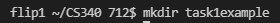

2) Using the terminal, make sure you "cd X" into that folder, with X being the folder name.

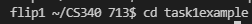

3) Run "pip3 install --user virtualenv"

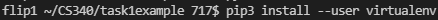

4) Run "python3 -m venv ." (the period . is part of the command, don’t forget it!).

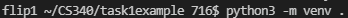

5) Run "source ./bin/activate", afterwards you should see (yourfoldername) flipX in the terminal which means we are successfully in the virtual environment.

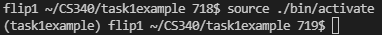

6) After that, run "pip3 install flask-mysqldb", don’t worry about updating pip or whatever it prompts you with – ignore that.

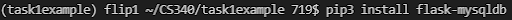

## Creating Your app.py

7) Create a file named "app.py".

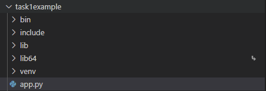

8) Populate that file with this code (don’t forget to save after):

```
from flask import Flask, render_template, json, redirect
from flask_mysqldb import MySQL
from flask import request
import os

app = Flask(__name__)

app.config['MYSQL_HOST'] = 'classmysql.engr.oregonstate.edu'
app.config['MYSQL_USER'] = 'cs340_UserName'
app.config['MYSQL_PASSWORD'] = 'xxxx' #last 4 of onid
app.config['MYSQL_DB'] = 'cs340_UserName'
app.config['MYSQL_CURSORCLASS'] = "DictCursor"


mysql = MySQL(app)


# Routes
@app.route('/')
def root():
    query = "SELECT * FROM diagnostic;"
    query1 = 'DROP TABLE IF EXISTS diagnostic;';
    query2 = 'CREATE TABLE diagnostic(id INT PRIMARY KEY AUTO_INCREMENT, text VARCHAR(255) NOT NULL);';
    query3 = 'INSERT INTO diagnostic (text) VALUES ("MySQL is working!")';
    query4 = 'SELECT * FROM diagnostic;';
    cur = mysql.connection.cursor()
    cur.execute(query1)
    cur.execute(query2)
    cur.execute(query3)
    cur.execute(query4)
    results = cur.fetchall()

    return results[0]


# Listener
if __name__ == "__main__":

    #Start the app on port 3000, it will be different once hosted
    app.run(port=3000, debug=True)
```

9) Towards the top of the app.py where we have 5 lines dedicated to your database credentials, make sure to fill that in. Change 'CS340_name' to your OSU account name, so in my case that would be 'CS340_kamanda'. Replace 'XXXX' with the last 4 digits of your OSU id.

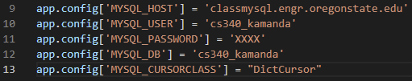

10) Change the port at the bottom to any port of your choosing (some ports might be taken, just choose a large number but not too large, there is a ceiling number on the flip servers). Generally, any number within 1024 < PORT < 65535 is acceptable. PORT < 1024 are privileged. Avoid numbers like 1234 (incremental increases), or 2222 (repeating) as students often prefer these easier numbers to type in and are often already in use.

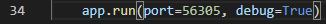

[//]: # " ## Filling your Database "

[//]: # " 11) (Ignore this step if you already completed the query portion of task 1) If you haven't done so already, pivot for a moment and log in to your school provided database via phpmyadmin (https://classmysql.engr.oregonstate.edu/index.php). Note that you can also accomplish the above steps 11-12 via the terminal or the webapp itself if you desire, but I find it's good practice to familiarize yourself with the phpmyadmin UI early, it's a great tool! "

[//]: # " 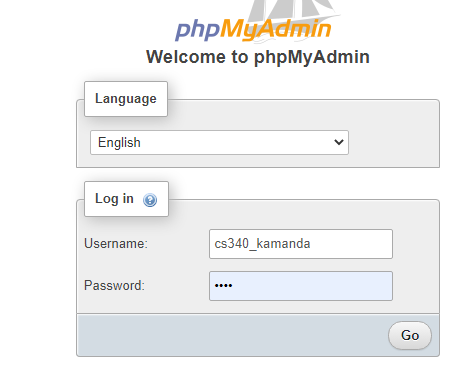 "

[//]: # " 12) (Ignore this step if you already completed the query portion of task 1) Execute the queries below in the SQL tab of phpmyadmin after importing the bsg_db.sql file in order to create a diagnostic table (as outlined in the module linked in step 10). These are the 4 lines of code, input them in the SQL tab and hit ‘Go’ (see screenshot below): "

[//]: # " ``` "

[//]: # " DROP TABLE IF EXISTS diagnostic; "

[//]: # " CREATE TABLE diagnostic(id INT PRIMARY KEY, text VARCHAR(255) NOT NULL); "

[//]: # " INSERT INTO diagnostic (text) VALUES (\"MySQL is working\"); "

[//]: # " SELECT * FROM diagnostic; "

[//]: # " ``` "

[//]: # " 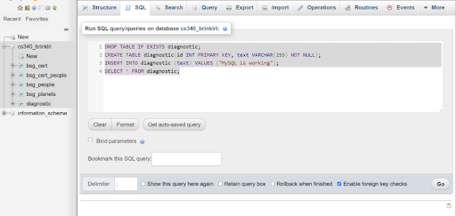 "

## Hosting on Flip Servers and Running Forever via Gunicorn

[//]: # " 13) Ok, back to app.py and VScode. Run \"pip3 install gunicorn\" via the Terminal. "

11) Ok, back to app.py and VScode. Run "pip3 install gunicorn" via the Terminal.
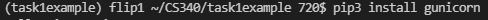

[//]: # " 14) Run \"gunicorn -b 0.0.0.0:XXXXX -D app:app\" replacing 'XXXXX' with your desired port number. "

12) Run "gunicorn -b 0.0.0.0:XXXXX -D app:app" replacing 'XXXXX' with your desired port number.

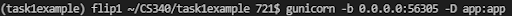

[//]: # " 15) Navigate to your web app address, i.e. http://flipX.engr.oregonstate.edu:XXXXX/ with the first 'X' being your flip server (1-3), and XXXXX being your port number. "

13) Navigate to your web app address, i.e. http://flipX.engr.oregonstate.edu:XXXXX/ with the first 'X' being your flip server (1-3), and XXXXX being your port number.

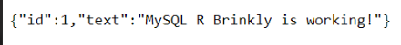

[//]: # " 16) Should you need to restart the web app after making changes, run \"pkill -u yourOSUAccountName gunicorn\" replacing yourOSUid and restart by running the command in step 14). Note that the pkill command will kill all of your flip gunicorn processes. "

14) Should you need to restart the web app after making changes, run "pkill -u yourOSUAccountName gunicorn" replacing yourOSUid (i.e. for me it would be kamanda) and restart by running the command in step 14). Note that the pkill command will kill all of your flip gunicorn processes. 

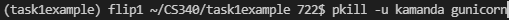

[//]: # " 17) Hopefully that was easy to understand and that you now have a basic functioning flask webapp. Feel free to tinker around now and add templating and the like (there is a section on templating and other good notes further into the guide)! Again, I can’t stress this enough – if you want further context and detail, please do read on through the main body of the flask guide. It's well articulated with the reasoning behind many of these steps, written by the wonderful TA Greg Kochera for past terms! This section is just a fast track to kickstarting a basic app as students in the past have gotten lost or had issues with some of the greater detail in the rest of the guide, but it definitely still contains valuable information. "

15) Hopefully that was easy to understand and that you now have a basic functioning flask webapp. Feel free to tinker around now and add templating and the like (there is a section on templating and other good notes further into the guide)! Again, I can’t stress this enough – if you want further context and detail, please do read on through the main body of the flask guide. It's well articulated with the reasoning behind many of these steps, written by the wonderful TA Greg Kochera for past terms! This section is just a fast track to kickstarting a basic app as students in the past have gotten lost or had issues with some of the greater detail in the rest of the guide, but it definitely still contains valuable information.

# Step 1 - Get The Tools Downloaded You Will Need

You are going to need a few things get going here.

## Text Editor

Text Editors are like clothes. Everyone has their preferences. I prefer VS Code so this guide will be built using that editor. You can use what you please. Atom, Sublime, Notepad, Vim, eMacs or even Notepad are completely acceptable. We just need to be able to edit our code.

## Database Engine

**MySQL** is the database we will be using in this class. It is already installed for you on the flip servers.

***Optionally*** you may wish to install a local copy of MySQL on your PC from [here](https://dev.mysql.com/downloads/mysql/) is a link to download MySQL Community Edition. Pick the correct operating system you are on, and follow the prompts. It will ask you to login or signup, just skim to the bottom and click "No thanks, just start my download."

> When setting up your MySQL installation, please make note of what you set the root password to. We will need this later. Keep it safe.

## Python

Python is the language we will be using to build our Flask application. It is also already installed on the flip servers. We will require Python 3 (or better) for the purposes of this project.

***Optionally*** you may wish to install a local copy of MySQL on your PC from [here](https://www.python.org/downloads/)

I won't get to specifics, but its fairly straightforward to install Python (if you want to). 

## Browser

Personally, I am a Firefox user. This guide will be using Firefox, but Chrome is also acceptable. I'm not familiar with Edge, but if you are, you can certainly give it a whirl also. Just be familiar with opening your developer console. On Firefox, its the F12 key.

## Terminal Application

On Windows, there isn't a native terminal (sort-of). so you will need to use PuTTY, PowerShell or another Terminal emulator and be familiar with it.

On Mac OSX, you already have a Terminal built in. If you open up Spotlight Search (CMD + Space), and type in 'Terminal', it should be the first option.

On Linux, nearly the same as Mac OSX, except that it will be in your Start Menu. Chances are if you are natively running Linux, you're already quite familiar with opening the terminal.

# Step 2 - Preparation

## Git

I'm a big fan of Git. You should be too. It's very forgiving and if you make a mistake, it's (usually) easy to go back to a point where things weren't broken.

This is a Portfolio Project. It will be yours to demo to prospective employers or show of to friends and family. Log in to GitHub, make a new repo, check the option to create a README.md file, and create!

In GitHub, when you are on your repo's homepage, you will see a green button that says code, click it and then ensure you copy your appropriate repo link.

> You might notice the options HTTPS, SSH and GitHub CLI above the text. Most users will want to use HTTPS. This will prompt you for a UserName and Password when pushing to the repo. If you don't want to do that every single time, I highly recommend learning how to interface with GitHub using SSH. It only takes a few minutes, and the upside is, you never have to type in your UserName and Password. It's how I do it and I've never looked back.
>
> Here is a link for those interested: [Connecting to GitHub with SSH](https://docs.github.com/en/free-pro-team@latest/github/authenticating-to-github/connecting-to-github-with-ssh)

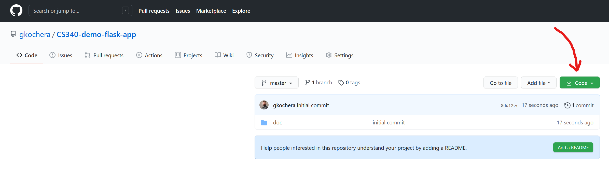
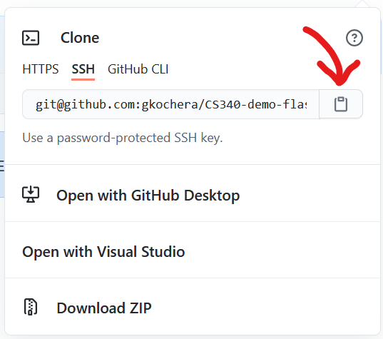

Once you have created a new repo and got your link, fire up your terminal. Navigate to a place where you want to clone your repo to. Cloning creates a new folder (named the same as the repo) so no need to create a new folder just to clone it to. Enter the following command:

```bash
git clone <link_you_copied_from_GitHub>
```

You can then check to see that the clone was successful by typing the following command in your terminal.

```bash
# Terminal
ls

# Command Prompt (Windows)
dir
```

You should see whatever was in the folder before AND a new folder with the same name as your repo.

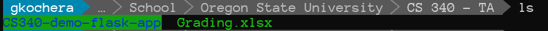

You can now navigate to the folder by:

```cd <name_of_your_new_folder>```

You will now be in your new folder created by cloning the repo.


> Your terminal prompt is likely to look a bit different than what you see in these images. I have customized mine. The commands on your terminal will still yield the same output, they just might be different colors or fonts.

## Create a .gitignore File

There are going to be certain things we don't want to submit to our repo, such as credentials, virtual environments, etc.

Create a file called `.gitignore` in the root of your directory.

You can add individual paths, files and folders on a line by line basis in this file. Git will ignore each of those paths, files or folders when keeping track of your repo. For VS Code users, there is almost always a folder called `.vscode` that gets created in your project root. You can add the line

```bash
/.vscode
```

to your `.gitignore` file. Whenver you manipulate your git repository, git will not even look in that folder or track it for changes. We will use this file later on.

## Python Virtual Environment (Optional but Recommended)

The short version is that you will be installing a few Python packages to support your web application. But we don't want to muddy up the installation of Python on our computer in the event something goes wrong. To this end, we can use Python "virtual environments" to essentially act as a stand-alone installation of Python dedicated solely to our web application.

Fire up your terminal, navigate to the root of your project folder (the top level of your repo folder):

```bash
# Logged into the school's flip servers
pip3 install --user virtualenv
```

We then want to run the command

```bash
python3 -m venv ./venv

```

This will create a virtual environment in your project root. It will be in the folder `venv` located in the project root. I *strongly* recommend adding `/venv` to your `.gitignore` file. This could save a lot of headaches down the road.

To activate the virtual environment (and we need to do this everytime we close out of the terminal or log off the computer):

```bash
source ./venv/bin/activate
```

If you want to verify if your virtual environment is currently active

```bash
which python3
# <path_to_your_repo_folder>/venv/bin/python3
```

If `which` outputs something like `usr/bin/python3`, you did something wrong. Go back through the steps and verify.

If you ever want to leave the virtual environment, that is easier yet

```bash
deactivate
```

Always remember to have your virtual environment running when working on your project.

## Install Flask and its Dependencies

This one is pretty straight forward. In your terminal, make sure your virtual environment is active if you have one, and run the following command
```bash
pip3 install flask-mysqldb
```

You'll see a bunch of text fly across the screen. Let's confirm the install went OK by typing

```bash
flask --version
```

You should see some output that looks like this!
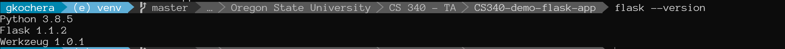

If not, go back and verify you followed the steps correctly.

## Project Directory Structure

Best to get this out of the way up front. You'll need to create a few folders. Get your repo organized in the following manner:

```
.
├── .gitignore 
├── README.md
├── app.py            
├── venv               <= Should be in your .gitignore
├── templates
│    └ main.j2          <= .j2 or .jinja2 is acceptable
└── static           
     ├ css
     ├ js
     └ img
```

If the folders do not exist, create them. If the files do not exist, create them with the correct name and extension, and just leave them blank for now.

# Step 3 - Building `app.py`

## Starting `app.py`

Finally, we can start writing our web app. Trust me, all the setup was worth it. Open your app.py.

Here is the absolute *bare* minimum code needed to get some output:

```python
from flask import Flask
import os

# Configuration

app = Flask(__name__)

# Routes 

@app.route('/')
def root():
    return "Welcome to the OSU CS 340 - Flask Tutorial!"

# Listener

if __name__ == "__main__":
    port = int(os.environ.get('PORT', 9112)) 
    #                                 ^^^^
    #              You can replace this number with any valid port
    
    app.run(port=port) 
```

Ok, techincally, it's not, you could do it with less. This sets us up for success later though, particularly if you end up deploying on Heroku.

Once you have your `app.py` filled out, let's verify that it works! Hop on over to the terminal:

```bash
python3 app.py

# app.py will be whatever you named your .py file if it wasn't 'app'
```
And you should see some output:

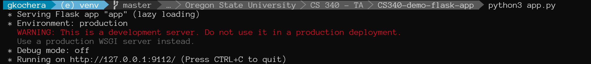

I should now be able to use Port Forwarding in VS Code and go into my browser, and enter that web address. 

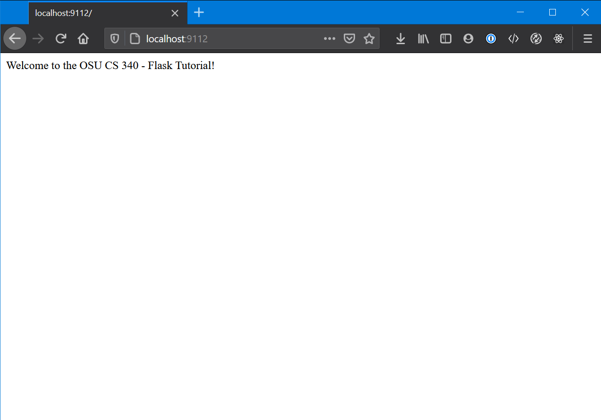

At this point, Flask is working, and our computer can see its output.

>A very useful option in Flask is to change the `app.run()` call in the following manner:
>
>```python
>app.run(port=port, debug=True)
>```
>This will force the server to reload whenever changes are made to your project, so that way you don't have to manually kill the process and restart it every time.

**Note:** if you are not able to browse to your app at this point because the Port Forwarding to your local PC is not set up, and already verified VPN is working then see the [gunicorn](#gunicorn) section below which explains how to use this instead. You'll need gunicorn to keep your app running after you logout anyway. 

# Step 4 - Templates

Ok, so sending a single string of text to the screen, kind of boring. I know. That's where a templating engine comes into play. With Flask, we will use Jinja2. It's actually already part of the Flask package and sufficient to use on this project.

## Setting up Templating in Flask

Navigate over to your `/templates` folder and open up the `main.j2` that you created.

The `.j2` extension is not mandatory, but makes it simple. You can also use `.jinja2` or `.jinja` if you really want to type it out every time; just keep it consistent in your project.

Throw some HTML in there. Yes, that's all a template is, just HTML. There is some special syntax that we can use in Jinja 2 that allows us to dynamically display data, but let's just get our template engine up and running for now.

```html
<html>
<head>
    <title>OSU - CS 340 - Introduction to Databases - Flask Demo Project</title>
</head>
<body>
    <h1>CS 340 - Introduction to Databases</h1>
    <p>This is a demonstration project created to show students how to create a Flask app and connect it to a MySQL database.</p>
</body>
</html>
```

Now we have that, navigate over to `app.py` and we need to import `render_template`.

```python
from flask import Flask, render_template
```

Then change the `return` value of the route
```python
return render_template("main.j2")
```

It will look like this
```python
from flask import Flask, render_template
import os

# Configuration

app = Flask(__name__)

# Routes 

@app.route('/')
def root():
    return render_template("main.j2")

# Listener

if __name__ == "__main__":
    port = int(os.environ.get('PORT', 9112))
    app.run(port=port, debug=True)
```

We can go back to our browser and verify that our changes were good

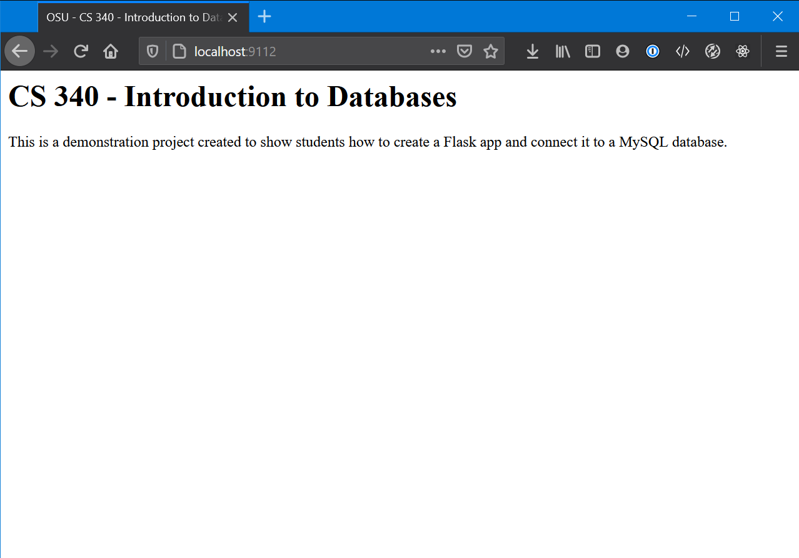

## Dynamically Displaying Data in a Template

Ok, so how do we get data from the server to display on the page? The power of templating of course! Before we get off to a roll here, I am going to point everyone to a very important link.

[Jinja 2 Template Designer Documents](https://jinja.palletsprojects.com/en/2.11.x/templates/)

Keep these handy when you are working with Jinja templates, they're invaluable.

So a quick demonstration. I'm going to create a list of dictionaries in my `app.py`, and use *delimiters* in my Jinja 2 template to parse the list passed in from `app.py`. Here is my sample list of dictionaries:

```python
people_from_app_py =
[
{
    "name": "Thomas",
    "age": 33,
    "location": "New Mexico",
    "favorite_color": "Blue"
},
{
    "name": "Gregory",
    "age": 41,
    "location": "Texas",
    "favorite_color": "Red"
},
{
    "name": "Vincent",
    "age": 27,
    "location": "Ohio",
    "favorite_color": "Green"
},
{
    "name": "Alexander",
    "age": 29,
    "location": "Florida",
    "favorite_color": "Orange"
}
]
```

I will modify the code in my route handler for the root path slightly.

```python
@app.route('/')
def root():
    return render_template("main.j2", people=people_from_app_py)
```

We added the default variable `people=people_from_app_py` to the `render_template()` call. 

The occurence of `people` on the left-side can be anything. This is the name we will use to access the list of dictionaries `people_from_app_py` from `app.py`.

Now we need to setup our template to use that data when it renders. Open up your template. Right now it is just HTML. We are going to use *delimiters* or special syntax defined by the Jinja 2 API to make use of extra data we pass to the renderer. Delimiters usually are segments of text with opening and closing brackets. Read about them more in the Jinja 2 API Docs.

```javascript
{{ }} // jinja statement
 // jinja expression
{# #} // jinja comment
```

Here is what we are adding to our Jinja 2 template

```html
<table>
    <thead>
    <tr>
        <th>Name</th>
        <th>Age</th>
        <th>Location</th>
        <th>Favorite Language</th>
    </tr>
    <tbody>
    
    <tr>
        <td>{{item['name']}}</td>
        <td>{{item['age']}}</td>
        <td>{{item['location']}}</td>
        <td>{{item['favorite_color']}}</td>
    </tr>
    
    </table>
```

Now, if you are not running your server in debugging Mode, restart it. Otherwise, open your browser, and navigate back to your page and check the result.

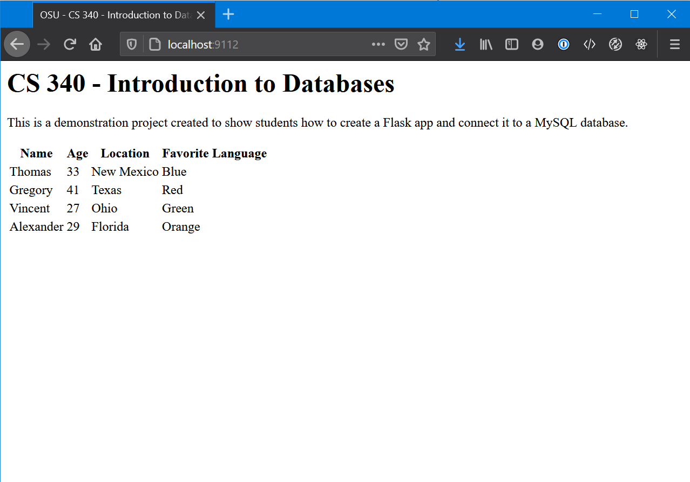

We have data from our `app.py` presented in our browser screen! That's pretty much it! At this point, data that is received by the server (from a database, external API, etc.) can now be presented to the renderer for display in the browser. 

> In the next section we are going to connect the database to the web app. In our case, the MySQL connector (library) we will be using returns data as tuples. So you'll have to adjust the above example slightly to account for that.

# Step 5 - Connecting the Database


## Accessing the Database

The database can be accessed a variety of ways: 
- PHPMyAdmin which is a web-interface that the school provides us with to access the MySQL database on the school's servers (so it won't work on your local machine).
- Good ol' command line via the `mysql` command
There may be others that I haven't mentioned. This guide will use the command line, but it should be easy enough to follow along if you are using one of the other GUI clients.

Let's get connected to the database, open your terminal and enter

```bash
mysql -u root -p
```
You will be prompted for a password. Enter your password and if all went well you will be greeted with a console in MySQL.

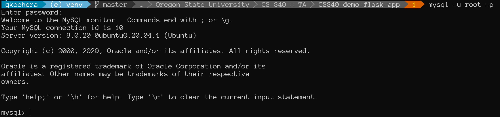

Once you are in here, you can run your SQL queries directly on the database. This is helpful if you are troubleshooting.

<a name="populating-database"></a>
## Populating the Database

MySQL makes it pretty straight forward to load data into it. You could do it line-by-line in the command line or load it from an SQL file where you have typed out the queries already.

We are going to create a new folder in our directory root called `database`. Everything in there will be database related items for the project.

In that folder, I have placed two files; `bsg-db.sql` and `bsg-DML.sql`. We will use the `bsg-db.sql` file to populate the database. Our directory structure now looks like this

```
.
├── .gitignore 
├── README.md
├── app.py            
├── venv               
├── templates
│    └ main.j2          
├── static           
│    ├ css
│    ├ js
│    └ img
└── database
     ├ bsg_db.sql
     └ bsg_DML.sql
```

Navigate to your `database` folder in terminal, then open up MySQL. We need to create a database to store the data in, use the database (make it the active one) and then load data into it from our file.

```SQL
CREATE DATABASE bsg;
USE DATABASE bsg;
source bsg_db.sql
```

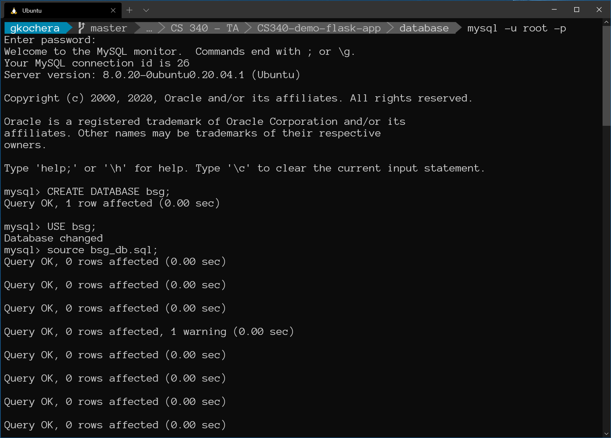

We can query the database now to verify our data loaded.

```SQL
SHOW TABLES;
```

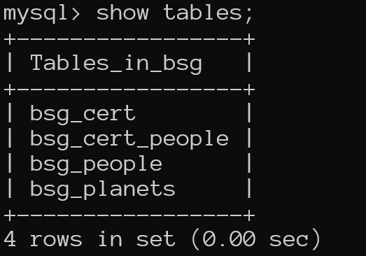

We can even get some details about the individual tables.

```SQL
DESCRIBE bsg_people;
```

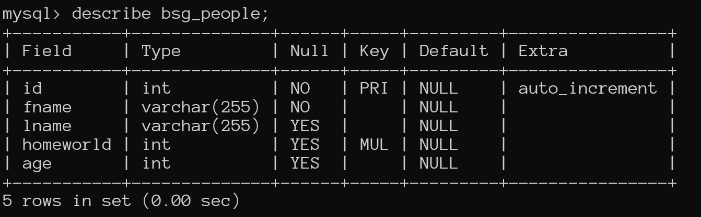

This will be very handy later on. We will need to know some information about the attributes when we pull the data from MySQL with Flask.

> You might notice the commands between steps are ALL CAPS or lower case. It really doesn't matter. MySQL understands just fine either way. The UPPER CASE convention just helps make the SQL keywords stand out but either way your queries will work just fine. The only time case matters is with your string literals (i.e. anything in quotes).

## Connecting the Database to Our App

We have a bit of work to do now. We need to write a bit of code to set up our connection to the database, establish how we are going to communicate with it, and do some other housekeeping while the app is running. Fortunately, @mlapresta has written much of the code needed to interface with this database. In our `database` folder, there are two files: `db_connector.py` and `db_credentials.py`.

`db_connector.py` handles all of the communication with the database. We will make calls to functions in it to connect, and run querires. `db_credentials.py` handles holding our credentials, more on this later.

> Storing live credentials in a python file is not the most secure way of handling secure information like hostnames, usernames and passwords. We will discuss later other ways of authenticating (that really aren't very complicated) which are more secure.

Back to our `app.py`, we need to import `db_connector`.

```python
import database.db_connector as db
```

After we import the `db_connector` module, we also need to create a connection in `app.py`

```python
db_connection = db.connect_to_database()
```

# Step 6 - Adding Queries to Your App and Displaying Data

Home stretch! This section will cover adding queries to your `app.py`, establishing the database connection, running the query, and parsing the return data to present to the browser.

## Running a Query

The process for querying data from a database essentially happens in 4 steps.

1. The user does something in the browser to request a specific set of data 
2. The server gets that request, crafts or uses a pregenerated query to query the database.
3. The response from the database is read, manipulated further if necessary
4. The data is sent back to the page via the `render_template()` method and presented to the user; the data can also just be returned as JSON.

In our app.py, we just need to add a new route (you can even use the existing `\` one). Add the route `bsg-people` under the routes section in your `app.py`.

> At this point in the guide, we can pull out the temporary dictionary we added with people, names, colors, etc. We can also remove `people=people` from the `/` route render_template call.

```python
# Routes 

@app.route('/')
def root():
    return render_template("main.j2")

@app.route('/bsg-people')
def bsg_people():
    return "This is the bsg-people route."
```

> The route `/bsg-people` does NOT have to match the name of the function, in this case, also `def bsg_people()`. It's just a convention used for ease of reading the code.
> Also, pay careful attention to the difference in the route having a hyphen (-) and the function name having an underscore (_).

Restart your server and navigate to the `/bsg-people` route in your browser.

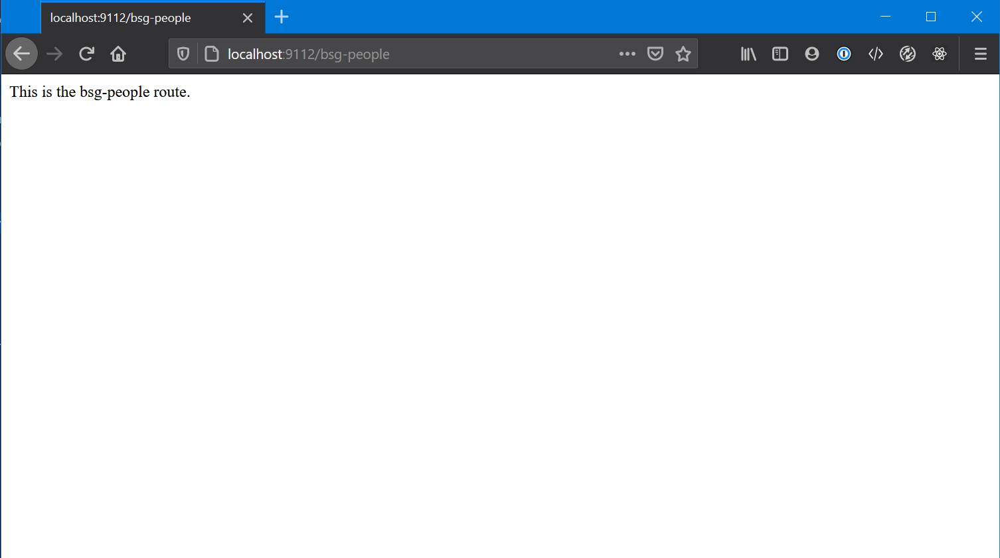

This satisfies Step 1.

Once that is working, we can setup our query and use our previous knowledge of dynamically displaying data to show it on the screen.

In our `app.py` we need to, now craft our query, and dispatch it to the database. We make the following change

```python
# At the top
from flask import Flask, render_template, json # add `json`

# In your routes, add this route
@app.route('/bsg-people')
def bsg_people():

    # Write the query and save it to a variable
    query = "SELECT * FROM bsg_people;"

    # The way the interface between MySQL and Flask works is by using an
    # object called a cursor. Think of it as the object that acts as the
    # person typing commands directly into the MySQL command line and
    # reading them back to you when it gets results
    cursor = db.execute_query(db_connection=db_connection, query=query)

    # The cursor.fetchall() function tells the cursor object to return all
    # the results from the previously executed
    #
    # The json.dumps() function simply converts the dictionary that was
    # returned by the fetchall() call to JSON so we can display it on the
    # page.
    results = json.dumps(cursor.fetchall())

    # Sends the results back to the web browser.
    return results
```

Restart (if not in debugging mode) and load up the `bsg-people` route now.

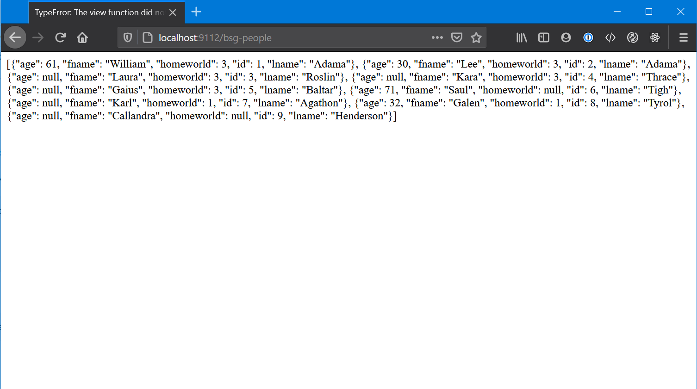

Confirmation that our webapp can now talk to our database!

> Note: Our data is being returned as a list of dictionaries. This setting can be changed if you would rather receive data back as a tuple of tuples (the default for the library we are using). This is done by changing `db_connector.py` in the following manner
>
>```python
># Return data as a list of dictionaries
>cursor = db_connection.cursor(MySQLdb.cursors.DictCursor)
>
># Return data as a tuple of tuples
>cursor = db_connection.cursor()
>```
>
> It's personal preference but I prefer dictionaries so I get the column name with each value, the choice is yours though.
> You'll have to adjust how you render the data in your template slightly with tuples.

In `app.py` we have taken care of Step 2, taking the request and sending it to the database, and Step 3, getting the response, parsing and manipulating it as necessary, and Step 4, dispatching it back to the browswer.

Now to put it through the `render_template()` function. We are going to create another template file, I will call it `bsg.j2`. 

```html
    <table>
    <thead>
    <tr>
        <!-- Iterate through each key in the first entry to get the
        column name -->
        

        <!-- Create a <th> tag with the key inside of it, this will be
        our header row -->
        <th>{{ key }}</th>

        <!-- End of this for loop -->
        
    </tr>
    <tbody>

    <!-- Now, iterate through every person in bsg_people -->
    
    <tr>
        <!-- Then iterate through every key in the current person dictionary -->
        

        <!-- Create a <td> element with the value of that key in it -->
        <td>{{person[key]}}</td>
        
    </tr>
    
    </table>
```

We need to make a small adjustment to our `app.py` now. Since, we were sending JSON back to the page directly in our last example. We now want to send the original list of dictionaries to the `render_teplate()` call and return that.

```python
@app.route('/bsg-people')
def bsg_people():
    query = "SELECT * FROM bsg_people;"
    cursor = db.execute_query(db_connection=db_connection, query=query)
    results = cursor.fetchall()
    return render_template("bsg.j2", bsg_people=results)
```

> Note: We have removed `json.dumps()` from around the `cursor.fetchall()` call. We do not want to turn this data to JSON when using our template renderer.

Everything should be in order now, restart your server if necessary and navigate to `\bsg-people` in your browser to verify.

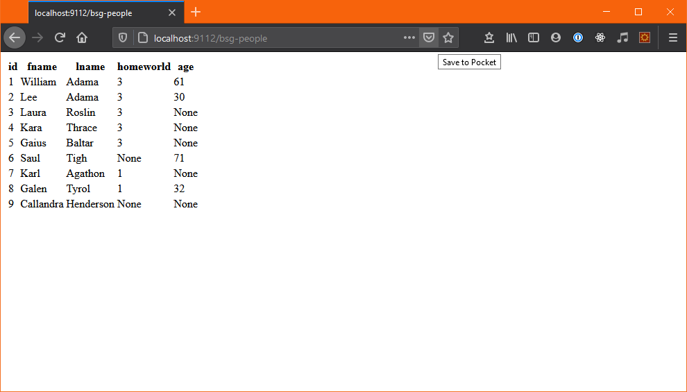

# Step 7 - Building a Basic CRUD APP

In this section, we’re going to go over the code for a basic CRUD (create, read, update, and delete) App using SQL data in the folder bsg_people_app which also contains the code for the completed App if you want to follow along or peruse at your leisure. For the purposes of this section, I’m going to assume you have a good handle on basic HTML coming from CS290. The HTML templates are fairly intuitive and also commented thoroughly; however, if you need to brush up on your HTML, there are many good web tutorials and resources.

## Our Initial Data, Templates, and HTML

Our initial SQL data to fill our database is contained in bsg_universe.sql, a file within our bsg_people_app folder. You can load up this data through phpmyadmin similar to what we did in Steps 11-13 of Step 0 at the top of this guide. Except this time instead of running a few queries, we want to navigate over to the import tab and select bsg_universe.sql from our PC to initialize our bsg database. Our database contains several entities like bsg_people and bsg_planets, but for the purposes of this brief tutorial, we are only creating a web page to represent bsg_people.

As stated earlier, I’m going to assume you have basic knowledge of HTML from 290, so I’m going to skip going over the HTML line by line. Earlier in this guide, we covered templating. For the purposes of this basic app, we are going to create two templates named people.j2 and edit_people.j2 and fill them with basic HTML, displaying a table of data along with buttons and forms allowing a user to add a new person to bsg_people or edit/delete an existing person.

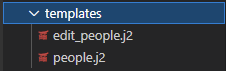

Earlier in this guide in Step 4, we went over how to access the list of dictionaries filled with some data from bsg_people and bsg_planets that we will pass from our app.py (you’ll see how this is created, stored, and passed later in this guide, stay tuned!). We access these dictionaries to fill our table, and populate elements of dropdown menus. So be sure to go back and refresh on that section if needed!
This will be the final front-end result of our HTML in people.j2:

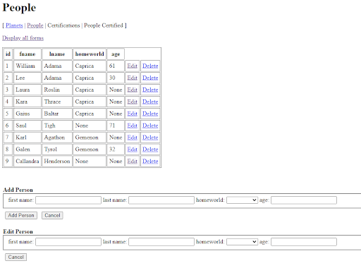

Upon clicking one of the edit buttons, we'll route to our edit_people.j2 page:

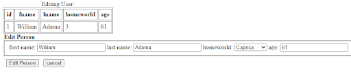

Alright, now let’s jump to the meat and potatoes of creating our routes and executing queries in our app.py file to fulfill our desired CRUD functionalities.

## Read

Before we formally begin with any functionality implementation, first we must fill in our database credentials in our app.py. If you recall from step 0, our app.py had a section at the top that looked something like this:


Make sure that information is properly filled out with user/db = ‘cs340_OSUusername’ and the ‘XXXX’ under password being the last 4 digits of your OSU id. This is the information of your school provided database, with the same credentials you use to login to phpmyadmin over at https://classmysql.engr.oregonstate.edu/index.php to manage your database, as explained in step 0 of this guide.

With that out of the way, let’s jump right in and begin by first tackling our read functionality by creating a table to view entries in the bsg_people entity. First, we need to create the route for our /people page. You can name the route anything you desire, but “/people” seems fitting for the entity bsg_people.

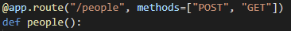

If you remember basic HTML, you should remember “GET” and “POST” methods, the former is generally used to receive aka GET data, and the latter is generally used to create/update aka POST data. Since we’re starting with our read step, we’re going to want to grab some data, so let’s start with our GET method.

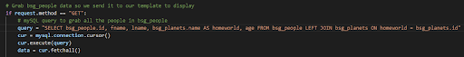

Let’s break down what’s happening here within our GET method. Our first step is to fire up our query. You’ll learn more about SQL queries later in the course so I’m going to refrain from going into too much detail (like JOINS, you’ll learn about these in a later course module). This is a basic SELECT query used to grab entity data, we’re selecting attributes from bsg_people (id, fname, name, homeworld, and age). Next, we are instantiating a cursor object (part of MySQL) which we will use to connect to our database and execute our query. This is all the data we’ll need to fill in our HTML table. Next, let’s grab some more data from our database to populate our homeworld dropdown form for our insert functionality.

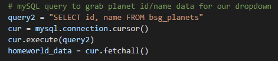

As you can see, it’s extremely similar to our code above, we’re just executing a different query, this time selecting data from bsg_planets for the purpose of populating our inevitable homeworld form dropdown.

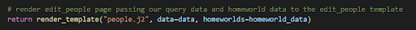

Finally, after we execute our query our final step is to render/display our template. We want to send this data to our people.j2 template, and we can do so via the syntax shown above. This is passing the data in the form of a tuple that contains dictionaries with our queried data, named “data” and “homeworlds.” You’ll notice in your HTML pages that we access this data using ‘{{ }}’ as our signifying syntax and calling elements directly or iterating through our dictionary using a for loop i.e. ‘{{ % for key in data[0].keys() % }}’ will give us our column names for our table. Again, this isn’t a HTML guide, so I encourage you to look over the template code with all the comments, and if further understanding is needed be sure to utilize online resources or ask a TA/Professor during office hours. 

## Create

In this section, we’re going to go over our “POST” method in our /people route to create a new person entry in bsg_people, otherwise known as INSERT functionality.

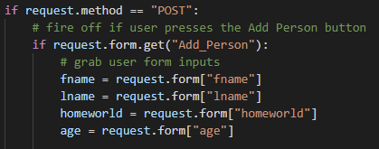

We want to grab data from form inputs when the user hits the ‘Add Person’ button on our web page, identified with ‘Add_Person’ in our HTML code. We grab fname, lname, homeworld, and age from each of the corresponding form labels. Now unfortunately, unlike our READ functionality we can’t simply rev up a query and execute it. We need to adjust our query based on the presence of NULL-able attributes. In the case of our bsg_people database, both homeworld and age can potentially be null. So how do we account for these cases? If statements. A homeworld value of '0' or an empty input in age correspond to null inputs.

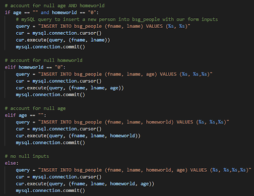

I know this is a large code block, but it’s a lot simpler than the length implies. We have 4 cases: null homeworld and null age, null homeworld, null age, or 0 null inputs. So we account for these with 4 if statements and thus, 4 separate queries. The syntax of our query is somewhat similar to our SELECT query from earlier, but this time we want to insert data, not select it, hence the INSERT. We are inserting into bsg_people and our database via the original SQL import file is set up to insert NULL by default if no input is given. So you can see our queries underneath null statements are leaving out ‘age’ or ‘homeworld’ or both.

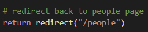

Lastly, we redirect back to the /people page after the query executes. We have now implemented our READ and CREATE functionality, two left: delete and update.

## Delete

Our delete implementation is really quite simple relative to our insert. We need to create a separate route for our delete functionality. However, let’s hit pause and take a brief look at our HTML. Remember when we created a delete button for each row of our table?

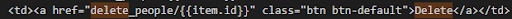

For our href link tied to each delete button, we purposely set each link to route to /delete_people/item.id, effectively passing the ‘id’ of the person we want to delete with the route itself so we can access it easily in our app.py. When a user clicks a delete button, it routes to our delete_people page with the id of the person in the associated row entry. So for example, if we click the delete button on row 1 of our table with say “William Adama - id 1”, our click routes us to /delete_people/1 . Now let’s get back to our app.py and create that delete route with this information in mind.

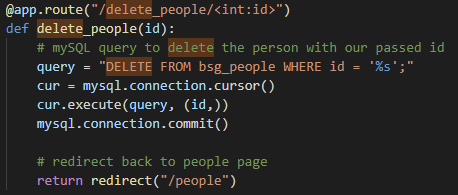

So as you can see at the top, our delete button link matches our app delete route. Our delete_people function just below is passed that ‘id’ variable directly from the route. We utilize a DELETE query, and we want to delete from bsg_people the person with the associated id. After executing our query, similar to our past code blocks, we route back to /people. Note that we never render a template akin to our /people route. We simply redirect back to /people. So while the /delete_people route exists, it never actually loads a page to display to the user, it all executes behind the scenes when the user clicks 'delete' and then immediately redirects them back to /people. 

You should be picking up the overall pattern here after two functionalities. Create route, set method (if applicable), grab form inputs (if applicable), create desired query, execute desired query, load page.

## Update/Edit

Now let’s move on to our final piece of CRUD functionality, update (also sometimes called edit). Let’s start by creating our route as we want to route to a new page where a user can fill out a form to update data associated with a person id. Similar to the delete route, we want to pass the ‘id’ of the user we want to edit through the route itself.

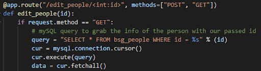

Unlike our delete route which is simply grabbing form inputs, executing a query, and immediately redirecting back to the /people page before actually loading anything, for edit, we need an actual page to load and display for /edit_people as our user needs to fill out a form. Because of this, we require a GET method like we did for our /people page. Inside the GET method, for some quality of life to the user, we’re going to select a slice of bsg_people and display it to the user – more specifically, the person the user is currently editing and their accompanying attributes from bsg_people. So similar to our /people query, we want to execute a SELECT query, but this time instead of selecting all of the people in bsg_people, we are only grabbing the one entry with our passed ‘id’.

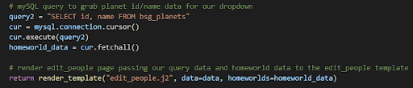

Similar to our earlier /people route, we need to also grab homeworld data from bsg_planets because our edit form is essentially a copy of our insert form. The user needs to be able to change inputs, so that requires all the same forms, including our homeworld drop down. Once we execute both queries, exactly like we did in our /people route, we render our edit_people template, passing the data gathered, ‘data’ and ‘homeworlds.’ This will allow us to create a mini-table that contains only one row, displaying the information of the person we are currently editing, and to also populate our homeworld dropdown.

Next, we need to code our POST method for actually updating the information of the person that we grabbed.

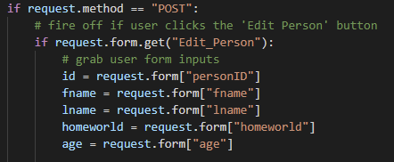

Look familiar? It’s a near carbon copy of how we kicked off our /people POST for our insert functionality. Grab the Edit_Person form (name of the inputs form in our edit_people html template), grab each of our attributes from their respective forms. Now you might be wondering, well there’s no ‘id’ form is there? The user never inputs an ‘id’! Well, we passed the id to our route, then in our HTML template, we created a hidden form that holds that ‘id’ value for the express purpose of utilizing it in our ‘POST’ method. 

You might also be wondering, why do we have to store that id in the first place, I thought we passed it to the route? We did, but that id is lost when our ‘GET’ method fires up and renders the template, so to circumvent that, we passed that id to the template via our earlier SELECT query, through our ‘data’ object, and then stored it in a form (named “personID”) that is marked as ‘hidden’ so it doesn’t appear on the user’s end. Passed to route --> sent through GET render_template --> stored in a hidden HTML form in edit_people.j2 --> accessed in 'POST' by grabbing it from that 'personID' form --> utilized in delete query.

Now, exactly like with our INSERT form, we need to account for the potential of null homeworld and/or age inputs:

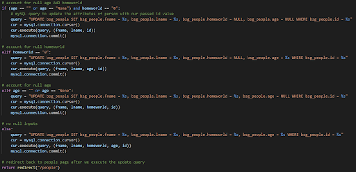

This code should once again look familiar as it’s a near copy of the INSERT form, we handle null inputs in precisely the same manner. The only difference? Our queries. We’re not inserting into bsg_people this time, we are simply updating an already existing person. Hence the UPDATE query as opposed to INSERT. After we execute our UPDATE, we redirect the user back to /people.

## Suggested Student Exercise

So voila, we now have a small, complete CRUD app for one entity in our bsg database, bsg_people. As a practice exercise, I encourage you to create a template named bsg_planets and fulfill CRUD elements for that page in app.py, representing the bsg_planets entity in our database similar to what we did with bsg_people. If there were any points of confusion during this tutorial, I implore you to load up the full code and walk through both the HTML and the app.py, reading through the comments to understand what’s happening and how they interconnect. You should be fairly familiar with how to create a basic HTML page from CS 290, but again, you may want to brush up on your knowledge.

# Conclusion

That is pretty much it! We setup our project, organized it, established a web server, verified it was working, setup our database, loaded it with data, and then used our `app.py` to act as an inteface between the user on our web app and the database.

From here, it's not very difficult to branch out. You can setup forms to capture user input, send it to `app.py` via a GET or POST request and update your database, add new entries, or even delete rows in the database. You can add style and interactivity to your webapp using CSS and JavaScript. The sky is the limit.

# Extra Bits

There are a few pieces of helpful information for everyone that really didn't fit well anywhere in the main guide but they're still really important for everyone to have access to. We talk about other serving options, migrating to OSU, and a brief discussion on securely storing credentials.

## Gunicorn

Gunicorn is a Web Server Gateway Interface (WSGI). For the purposes of our class, it really is just important to know that this is a different method for serving your application.

To install Gunicorn is quite simple (make sure your virtual environment is active if you have one), we enter in the terminal

```bash
pip3 install gunicorn
```

Once we installed it and all went well, we need to create a file for Gunicorn to use and know what app to serve. Create a file called `wsgi.py`. We just need a few lines of code.

```python
from app import app

if __name__ == "__main__":
    app.run()
```

Lastly, we go back to our terminal and run `gunicorn`.

```bash
gunicorn --bind 0.0.0.0:<your-desired-port-here> wsgi:app -D
```

Pay note to the `-D` switch here. When we add this switch, it tells Gunicorn to 'daeomonize' its process, which allows it to run in the background, and will not exit when you logoff, close your terminal or otherwise. This applies on the flip server and on your local machine. If you are just testing and *do not want the application to stay alive after logging off* simply omit the `-D` switch.

Once Gunicorn is running, you should be able to navigate to `localhost:port` on your browser where `port` is the port you specified when you ran Gunicorn and see your webapp in all of its glory!

If you run Gunicorn with the `-D` switch, you'll likely wonder, well how do I close it. Open your terminal

```bash
ps ax | grep gunicorn
```
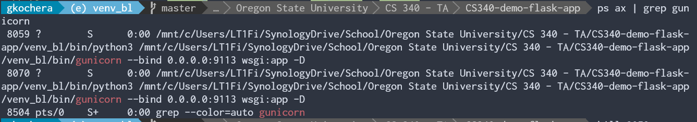

You will see 4 or 5 digit integers on the left, and you might also see your username if you read further down the line. The very first number is the number of the main `gunicorn` process we want to `kill`. In this example I need to `kill 8059`

Once you `kill` the process will shut down and the web server is no longer running. You can restart it again however you would like.

>When logged into OSU's servers, you might get a very long list of processes, you will have to scroll through and find the very first process number or `PID` of `gunicorn` under your username.

## Collaborating with others on OSU servers

This sounds like it would be very complicated but it truly isn't. In just a few steps, your project partner can get any code you developed and migrate it over to thier account on OSUs server with extreme ease. We just need to do it in a few steps.

### Requirements.txt
We need to generate a file to basically keep track of all the dependencies Python needs to operate and run our webserver. Fortunately `pip3` makes this very simple. Open up your terminal in the root of your project and enter

```bash
pip3 freeze > requirements.txt
```
This will create a file called `requirements.txt` in the root of your project. If you open it up, its really just a simple list of all the packages we have installed in our virtual environment to get the project running.

> If you did not setup a virtual environment and have been installing packages during your time at school on your local installation, this list can be VERY long. Its **strongly** encouraged that you develop using a virtual environment for this reason.

In essence, `requirements.txt` is *basically* the equivalent of `package.json` in a Node.js project. Not, exactly, but for our purposes its a sufficient explanation.

### Getting a Dump of your Local Database

We need to get all that data from our local server over to the OSU server. Perhaps we setup a ton of entities, attributes and relationships but we don't want to reconstruct it by hand, obviously. Fortunately, MySQL provides a tool that makes this abundantly easy. 

Navigate to your projects `/database` folder we setup.

Enter the following command in your terminal

```bash
mysqldump -u cs340_onid -h classmysql.engr.oregonstate.edu -p cs340_onid > backup.sql

# Example
mysqldump -u cs340_lastnamef -h classmysql.engr.oregonstate.edu -p cs340_lastnamef > backup.sql
```

- `mysqldump` is just the name of the utility
- `backup.sql` is the name of the output SQL file. You can make this whatever you would like, just keep the extension for ease of identification

### Ensure Your Project is Pushed to GitHub

We should all be familiar with this by now. Make sure that your commits are all pushed to the remote repository, in this case we are using GitHub.

In your terminal this can be done like such

```bash
git status
```

And our output *might* look like this

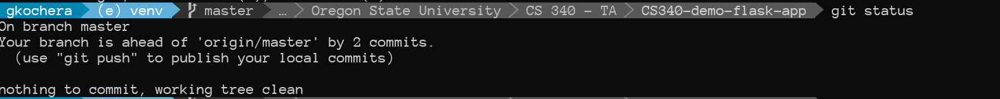

If it says anything other than being 'up to date', go ahead and enter the command

```bash
git push
```

We can follow that up with another `git status` command to verify we are 'up to date'

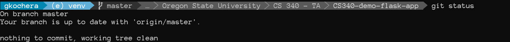

Once we are 'up to date' we can move on

### Cloning a Repository 

Add your project partner as a collaborator to your repo. Then have them folow these steps:

Establish an SSH session with any flip. Some people use username/password authentication, others have setup SSH keys, doesn't matter. Once, you have established a shell with `flipX`, we can migrate. 

> It's very important that you stay consistent in your use of the `flip` you are on. i.e. If you login with `flip2` and serve your app, then that will be the flip your app is accessible from. (Serving your app on `flip2` means you can't access it on `flip1` or `flip3`)

When you establish a shell with `flipX`, you should arrive in your home folder indicated by your current directory being shown as `~`. If this is not the case, go ahead and enter the command

```bash
cd ~
```
This will place you in your home folder.

We now can clone the repository. Enter the following command
```bash
git clone <full_path_to_your_git_repo_here>

# Example of cloning this repo using SSH (if you have keys setup)
git clone git@github.com:gkochera/CS340-demo-flask-app.git

# Example of cloning this repo using HTTPS (if you want to use username/password)
git clone https://github.com/gkochera/CS340-demo-flask-app.git
```

A folder with the name of your repository is now shown in your home directory. You can verify this by entering the `ls` command.

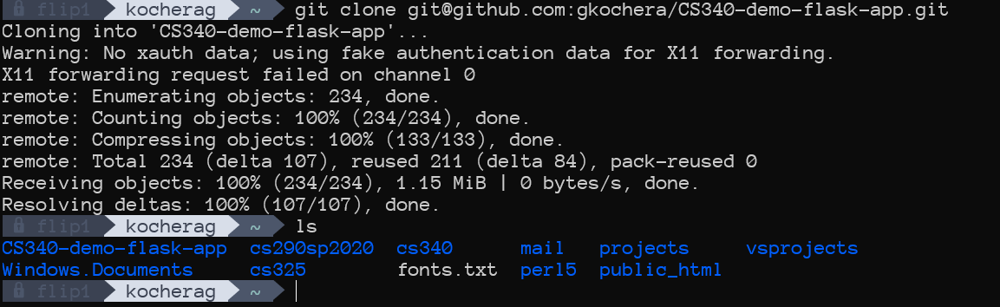

Navigate to that folder using `cd <name_of_folder_here>`

### Installing Dependencies from Requirements.txt

I would strongly suggest setting up another Virtual Environment here. Remember, we added our local virtual environment to the `.gitignore` file so as a result, it won't be in thie directory we cloned. When you create a new virtual environment, be sure to add that folder to your `.gitignore` file too so we don't mix up all of our virtual environments. [Here](#python-virtual-environment-optional-but-recommended) is where we discussed setting up a virtual environment, the process is the same on the OSU server.

Once you have that all done, and your virtual environment activated, go ahead and enter the following command from the root of your project, not your home folder.

```bash
pip3 install -r requirements.txt
```

That's it, all the necessary dependecies are now installed.

### Populating your OSU Database

Remember that file we created in `/database` called `backup.sql`? We're going to need that. Let's navigate to our `/database` folder on the **OSU** server (i.e. "The FLIP").

We need to get access to the database command line for the school, we do this as such

```bash
mysql -u cs340_username -p0000 -h classmysql.engr.oregonstate.edu
```
- `cs340_kocherag` : Replace with your **Database** username, not your ONID Username only
- `0000` : **! VERY IMPORTANT !** This is where your password goes, by default its the last 4 digits of your ONID. Notice there is no space between `-p` and `0000`, this is important and not a typo.
- `classmysql.engr.oregonstate.edu` always the same

If all went well, we are logged in and probably see a screen similar to this.


We can now enter SQL commands. The first one is going to be

```SQL
show databases;

# Output
# +--------------------+
# | Database           |
# +--------------------+
# | cs340_kocherag     |
# | information_schema |
# +--------------------+
# 2 rows in set (0.003 sec)
```

The database with our username is the one we want so we now enter

```SQL
use cs340_kocherag;
# you would replace `cs340_kocherag` with the name of your database shown in the previous step
```

Lastly, we enter the command

```SQL
source backup.sql;
```

At this point, you will see a bunch of stuff, indicating the dump file we created is being loaded into the OSU database, it should be a very quick process. 

Lastly, we can verify that all went well by typing the command

```SQL
show tables;

# Output
# 
# +--------------------------+
# | Tables_in_cs340_kocherag |
# +--------------------------+
# | bsg_cert                 |
# | bsg_cert_people          |
# | bsg_people               |
# | bsg_planets              |
# +--------------------------+
# 4 rows in set (0.001 sec)
```

With that, our database is loaded.

### Changing our Credentials

Now that the project is going to be running on a different computer, with a different path to the MySQL server and different username and password, we need to change the credentials. 

> You will inevitably notice that when you `git push` from the OSU side, and then `git pull` on your local machine, it will overwrite your `/database/db_credentials.py`. It will get annoying very quickly doing the back and forth. Further down, I discuss a few alternatives that are better (and more secure).

For now, open up `/database/db_credentials.py` on the OSU server. The easiest way to do this, is to navigate to `/database/` if you aren't already there and type `vim db_credentials.py`. 

> You can edit the file with whatever you would like. If you have VS Code installed, *usually* you can just type `code .` from the folder you are in and it will open VS Code with a remote connection to the school's server (if you set this up already in VS Code).

You should be presented with a very terminal-ish looking text editor that has the contents of your `db_credentials.py`.

Comment out the `host`, `user`, `passwd` and `db` that we set up for local environment and uncomment the ones below that which are `For OSU Flip Servers` as such

> To edit text in `vim` press the `i` key. This puts you in insert mode. You can use the arrow keys to navigate around and move your cursor up and down to make changes. When you are done making changes press the `<ESC>` key and type `:wq`. This will save the changes and close the file.

```python

host = 'classmysql.engr.oregonstate.edu'      # MUST BE THIS
user = '<your_osu_db_user_name>'       # don't forget the CS_340 prefix
passwd = '<your_osu_db_password>'               # should only be 4 digits if default
db = '<your_osu_db_name>'
```

Once are credentials are updated, we can now deploy our migrated project

### Running the app

Navigate back to the root of your project and run Gunicorn

```bash
gunicorn --bind 0.0.0.0:<your_port_choice_here> wsgi:app

# Remember to add the -D switch if you want gunicorn to run persistently even after you log off
```

> If you get an error here, its almost certainly either your credenital file has the incorrect credentials or someone is already using that port number on the flip. Verify your credentials are correct and then try a different port number. Valid port numbers are higher than 1023 and up to 65535. Avoid ports with repeating or incrementing digits like 2222 or 5678. Students usually choose these because they're *easy* to remember.


Open up your browser (make sure you are connected to the VPN) and enter

```bash
http://flipX.engr.oregonstate.edu:<your_chosen_port_here>
```

And we should see our project!


Check the `/bsg-people` route...


We have confirmation that...
- Our project is on the OSU Flip Server
- The database is correctly loaded
- The webapp is running and functioning correctly
- We did everything right!

## A Better Way to Store Database Credentials

Let's take a brief moment to talk about security. It's important. We all agree. You wouldn't take your car (a very valuable object) keys, leave them next to your car when you park it. Well, then you shouldn't take your credentials and store them on GitHub (or any other public repository).

A few things play into assessing how secure you need to be...

1. How likely is your app to be attacked?
2. How severe could the damage be if your app is attacked?

In our case, both are pretty low to non-existent. It's unlikely there are roving bands of hackers wandering the internet looking for OSU students taking CS 340 wanting to sabotage their project. They would have to break through the VPN, and into the database server. And in the event your database was deleted, would it be a huge amount of effort to recreate it? Probably not. If you really want to be on your A-game,  to an SQL file once the project is setup and keep that file in a safe place. If you ever need to recover, its only a few commands to get back up and running.

Now I get, that when we are just protyping and figuring things out, it might be easy to standup a quick database with a simple password and save it in a `*.py` file. What harm is going to be done if there is nothing of value in the database? Probably not much. However, as you move on to the "real world", server downtime and data loss can cost a company an obscene amount of money to fix, so keys sort of become a vital thing to protect. Think about how Facebook or Amazon would answer the above two questions? 

We can do a bit better.

### Environment Variables

Environment variables are strings of data that are stored in machine memory. They're volatile, so when the machine turns off or reboots, it goes away. It makes it just slightly harder for the attacker to get access to your 'secrets'.

Right now, if you followed this guide from the beginning, we have setup our project to read the credentials from `db_credentials.py`. That's going away. We will still need the information in it like the host, username and password.

Navigate to the root of your project on your local machine and create a file called `.env`. That's right, no name, just the extension. This will be a text file we keep our secrets in.

Inside that file, we write down our secrets in the following fashion:

```bash
340DBHOST=localhost
# should always be the same

340DBUSER=root             
# change root if you setup your project to use a different username

340DBPW=password
# password for said username if any otherwise just leave everything after = blank

340DB=bsg
# name of your local database name for the project
```

You can consolidate everything down to its own line, so 4 lines in total, the comments are just added for clarity, here is a second example without comments.

```bash
340DBHOST=localhost
340DBUSER=root
340DBPW=imnottellingyou
340DB=bsg
```

Now, save that and open up your `.gitignore` file. Add `.env` to it. **We do not want this to be pushed to our GitHub repo, ever.** They're secrets afterall.

Open up a terminal, if you don't have one open already and run the following command (make sure if you have one, your virtual environment is running)

```bash
pip3 install python-dotenv
```

> If you get a massive wall of red text indicating some sort of error about a wheel missing, run `pip3 install wheel` then try again. Not all users will have this issue but I came across it and figured it was worth mentioning.

Now we have to adjust our code. First, delete `db_credentials.py` in your `database` directory. Or, at the very least, remove the information from it, we don't need it anymore. Now open `db_connector.py`. Remove this line...

```python
from database.db_credentials import host, user, passwd, db
```

and replace it with this

```python
import os
from dotenv import load_dotenv, find_dotenv
```

Now below all of your imports in `db_credentials.py` but before your first function declaration add this

```python
# Load the .env file into the environment variables
load_dotenv(dotenv_path)

# Set the variables in our app to the already set environment variables
host = os.environ.get("340DBHOST")
user = os.environ.get("340DBUSER")
passwd = os.environ.get("340DBPW")
db = os.environ.get("340DB")
```

These are the calls to retrieve the needed 'secrets' from the operating system environment.

After your done, the top of your `db_connector.py` file should look like this

```python
import MySQLdb
import os
from dotenv import load_dotenv, find_dotenv

load_dotenv(find_dotenv())

host = os.environ.get("340DBHOST")
user = os.environ.get("340DBUSER")
passwd = os.environ.get("340DBPW")
db = os.environ.get("340DB")
```

Run your app now, and if all went well, it runs. And now, your secrets are well, a little more secret. Now, we have to handle the flip side of things; No pun intended. 

First, _make sure you added your `.env` file to `.gitignore`!_

Now, commit and push your changes to GitHub or whatever remote repo you are using.

Then, login to the flip server you plan on hosting on, and navigate to the root of your project, and perform a `git pull`. This will update the files on the flip server to mirror all the work we just did.

Activate your virtual envirionment and once again install `dotenv` by entering
```bash
pip3 install dotenv
```

Now, here's the cool part, create a new `.env` in your project folder on the flip server. This time, it will look a bit different like this

```bash
340DBHOST=classmysql.engr.oregonstate.edu
340DBUSER=cs340_lastnamef
340DBPW=maybea4digitnumber
340DB=cs340_lastnamef
```

You want to modify these values for each of your own purposes. Change out the relevant sections of your `.env` to fit your OSU credentials for the database.

Save the file, and as long as everything went well. Run your server. You should be graced with a list of people from the bsg-people table if you go to the `/bsg-people` route.

Thats it. Basically the `.env` acts like a little key for our deployments, locally or on OSU's servers. When the app loads on the flip, it uses the OSU credentials stored in the `.env` file on the flip. When the app loads on your local computer, it uses the credentials stored in the `.env` file on your computer.

You no longer are storing sensitive information like database passwords and hostnames on GitHub for all to see. Is this the best security? No. You can encrypt your secrets, you can store them in other areas of the computer, you can even store them in the cloud and lease out the secrets when the app runs. It's way beyond the scope of this, but for those interested, here is some extra reading.

[Best practices for managing and storing secrets including API keys and other credentials [2020]](https://blog.gitguardian.com/secrets-api-management/)

Ideally, you would store the `.env` file somewhere completely out of your project. As long as you have permissions to the directory, you can modify the code in the `load_dotenv()` call to access it. This is just a taste of how to do it.

# Extra Documentation

- [Flask](https://flask.palletsprojects.com/en/1.1.x/)
- [Jinja 2 Template Designer Documentation](https://jinja.palletsprojects.com/en/2.11.x/templates/)
- [Git - The Simple Guide](https://rogerdudler.github.io/git-guide/)
